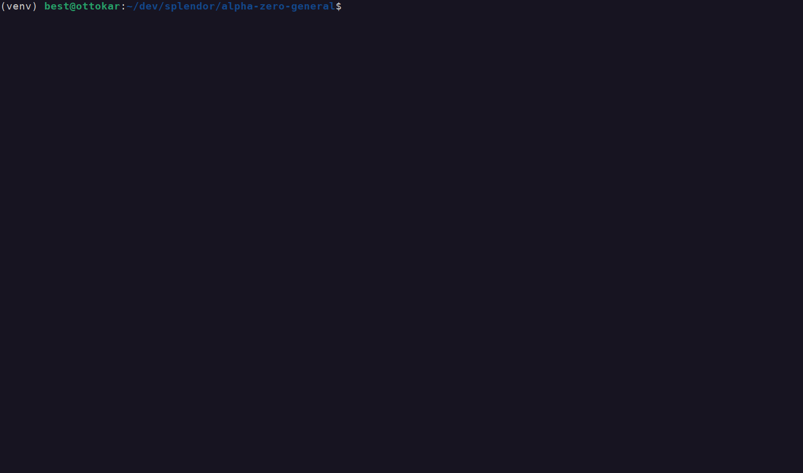
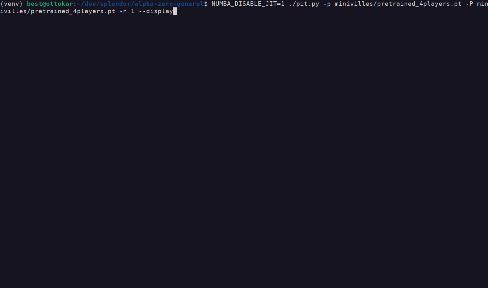
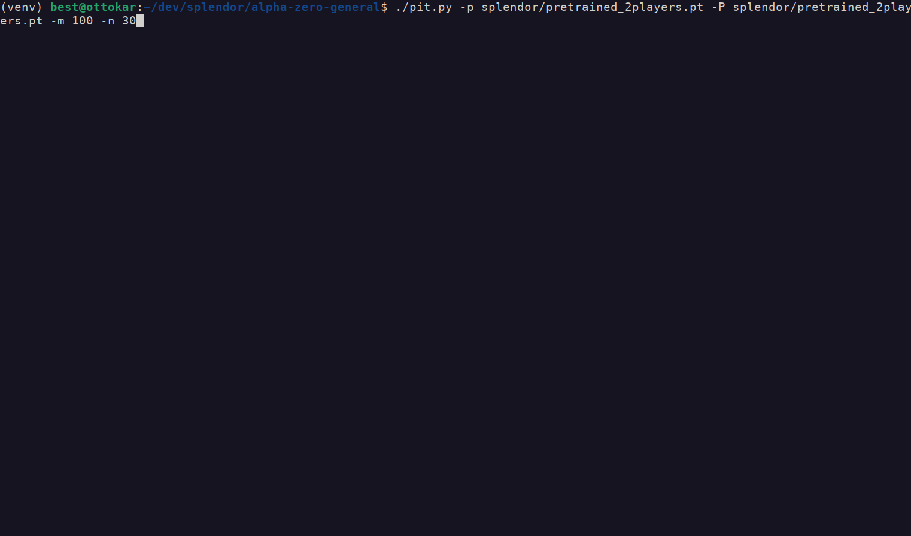

# My Alpha Zero General (any game, any framework!)

Based on the superb repo https://github.com/suragnair/alpha-zero-general, with the following additions:

### Added Features

* [x] Added Dirichlet Noise as per original [DeepMind paper](https://www.nature.com/articles/nature24270.epdf), using this [pull request](https://github.com/suragnair/alpha-zero-general/pull/186)
* [x] Compute policy gradients properly when some actions are invalid based on [A Closer Look at Invalid Action Masking inPolicy Gradient Algorithms](https://arxiv.org/pdf/2006.14171.pdf) and its [repo](https://github.com/vwxyzjn/invalid-action-masking)
* [x] Speed optimized
  * [x] Reaching **about 3000 rollouts/sec on 1 CPU core** without batching and without GPU, meaning 1 full game in 30 seconds when using 1600 rollouts for each move
  * [x] Neural Network inference speed and especially latency improved, thanks to ONNX 
  * [x] MCTS and logic optimized thanks to Numba, NN inference is now >80% time spent during self-plays based on profilers
* [x] Improvements based on [Accelerating Self-Play Learning in Go](https://arxiv.org/pdf/1902.10565.pdf)
  * [x] Playout Cap Randomization
  * [x] Forced Playouts and Policy Target Pruning
  * [x] Global Pooling
  * [ ] Auxiliary Policy Targets
  * [x] Score Targets
* [ ] Set up HyperParameters Optimization, like Hyperband or Population-Based Training

### Splendor

* [x] Support of [Splendor game](https://en.wikipedia.org/wiki/Splendor_(game)) with 2 players
* [x] Support of 3-4 players (just change NUMBER_PLAYERS in main.py)
* [x] Proper MCTS handling of "chance" factor when revealing new deck card
* [x] Optimized implementation of Splendor, thanks to Numba
* [x] Explore various architecture
* [x] Added pretrained models for 2-3-4 players

There are some limitations: implemented logic doesn't allow you to both take gems from the bank and give back some (whereas allowed in real rules), you can either 1-2-3 gems or give back 1-2 gems.

### Machi Koro / Minivilles
* [x] Quick implementation of [Minivilles](https://en.wikipedia.org/wiki/Machi_Koro), with handful limitations

### The Little Prince - Make me a planet
* [ ] Quick implementation of [The little prince](https://cdn.1j1ju.com/medias/67/f8/eb-the-little-prince-make-me-a-planet-rulebook.pdf), with limitations. Main ones are:
   * No support of 2 players, only 3-5 players are supported
   * When market is empty, current player doesn't decide card type, it is randomly chosen.
   * Grey sheeps are displayed on console using grey wolf emoji, and brown sheeps are displayed using a brown goat.

### Others changes

* [ ] Include ELO-like ranking
* [x] Improved prints (logging, tqdm, colored bards depending on current Arena results)
* [x] Parameters can be set in cmdline, added new parameters like time limit

### Technical details
#### Dependencies
`pip3 install onnxruntime-noopenmp numba tqdm colorama coloredlogs`
and
`pip3 install torch==1.8.1+cpu -f https://download.pytorch.org/whl/torch_stable.html`

The noopenmp version of onnxruntime is faster for single thread execution. This is the recommended way for fast exploration of hyperparameters, using several threads.

#### How to play versus saved engine
`./pit.py -p splendor/pretrained_2players.pt -P human -n 1`

Switch -p and -P options if human wants to be first player. You can also make 2 networks fight each other.

#### Recommended settings
`main.py -m 1600 -v 15 -T 30 -e 500 -i 5 -p 2 -d 0.50 -b 32 -l 0.0003 --updateThreshold 0.55 -C ../results/mytest`:

* Start by defining proper number of players in SplendorGame.py and disabling card reserve actions in first lines of splendor/SplendorLogicNumba.py
* `-v 15`: define loss weights of value estimation vs policy, higher mean more weights to value loss. Suraganair value of 1 lead to very bad performance, I had good results with `-v 30` during first iterations, and then decrease it down to `-v 10`
* `-b 32 -l 0.0003 -p 2`: define batch size, learning rate and number of epochs. Larger number of epochs degrades performance, same for larger batch sizes
* `--updateThreshold 0.55`: result of iteration is kept if winning ratio in self-play is above this threshold. Suraganair value of 60% win seems too high to me

Use of forced rollouts, surprise weight, cyclic learning rate or tuning cpuct value hadn't lead to any significant improvement.

#### How to evaluate training results
If you executed several training in parallel, you can evaluate the results obtained in the last 24 hours by using this command (execute as many times as threads):
`./pit.py -A 24 -T 8`
